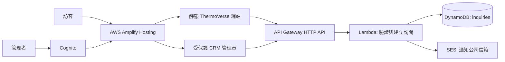

# ThermoVerse AWS 網站與 CRM 實作方案

更新：2026-09-16（臺灣時間）

## 已決定的方向

正式網站、表單、詢問資料與管理後台都遷移到 AWS。Squarespace 不再作為網站或 CRM 的正式依賴；目前 Squarespace 內未儲存的表單草稿不會套用。

現有 `website/` 為英文優先、靜態 HTML/CSS/JavaScript 網站，可直接作為第一版前台來源。既有中英頁面與內容結構要保留，不因遷移而縮減。

## 建議架構

| 範圍 | AWS 服務 | 實際用途 |
|---|---|---|
| 網站託管、CDN、HTTPS、預覽環境 | Amplify Hosting | 從 Git repository 自動部署目前 `website/` 靜態網站；保留 preview branch。 |
| 自訂網域 | Route 53 或原 DNS 供應商 + ACM | `thermoverse.com`、`www` 及日後 `staging` 子網域；ACM 管理 TLS 憑證。 |
| 表單 API | API Gateway HTTP API + Lambda | 僅接受經驗證、結構正確的網站詢問。 |
| 詢問 CRM | DynamoDB | 儲存詢問內容、來源頁、語言、狀態、內部備註、建立／更新時間。 |
| 管理登入 | Cognito | 僅授權 ThermoVerse 管理人員查看、搜尋、更新 lead status、匯出資料。 |
| 通知 | SES | 送出新詢問通知；收件信箱在部署時指定，不寫死在前端或程式碼。 |
| 防濫用 | WAF CAPTCHA / rate limit + Lambda 驗證 | 於正式表單啟用，並加入 honeypot、IP rate limit 與伺服端 schema validation。 |
| 可觀測性 | CloudWatch | Lambda 錯誤、API 錯誤率與通知寄送失敗告警。 |

## 首版可交付功能

### 公開網站

- 以目前 `website/` 的 Home、LATCHES、Use Cases & Services、About Us、Contact Us、中英文頁面部署。
- URL 與 SEO 設定改由 AWS 控制，非 Squarespace。
- CTA 導向同站的聯絡表單，不需要跳轉到第三方平台。

### 兩種詢問表單

**Energy Services Inquiry**

- Name（必填）
- Email（必填）
- Company or organization（選填）
- Role or title（選填）
- Inquiry type（必填：BPI energy assessment、ASHRAE audit、MEP consulting、Energy retrofits、General inquiry）
- Message（必填）

**LATCHES POC Inquiry**

- Name、Email（必填）
- Company or organization、Role or title、Message（選填或依最終 UX 設定）
- Site type、Site location、Building/facility description、Current building/energy challenge、Available building/HVAC/energy data、Preferred contact time（選填）

兩張表單都儲存 `source page`、`language`、`createdAt`、`status: new`。行銷同意欄位不會啟用，直到公司核准隱私權、資料保留與同意文字。

### CRM 管理後台

- Cognito 登入。
- 查看詢問、以狀態篩選（New / In review / Contacted / Closed）、全文搜尋與內部備註。
- CSV 匯出僅限授權管理者。
- 不納入完整報價、行銷自動化、招募或銷售 pipeline，除非另行擴充。

## 遷移執行順序

1. 整理目前 `website/`，修正預覽表單為 API contract，但尚不啟用外送。
2. 建立 AWS 基礎設施為可重複部署的 Infrastructure as Code；環境分為 `staging` 與 `production`。
3. 部署 staging：Amplify 靜態站、API、DynamoDB、Cognito、SES sandbox 測試。
4. 以非個人測試資料驗證表單寫入、通知、登入、狀態更新與 CSV 匯出。
5. 綁定正式網域與 TLS，進行 DNS 切換。
6. 取得公司書面核准後，才將正式收件信箱、資料保留期間、隱私權內容與 production SES 寄送權限啟用。
7. Squarespace 在 DNS 與正式 AWS 驗證完成後再退出；在此之前保留可回退狀態。

## 需要公司在正式部署前提供的資料

- AWS account／IAM 管理權限或由我建立最小權限部署角色。
- 網域 DNS 控制權（Route 53 或現有供應商）。
- 新詢問的公司收件信箱。
- CRM 管理者名單。
- 隱私權政策、合法蒐集目的、資料保留期限與行銷同意文案。
- 對技術、效能、安全、法規、節能、碳排與碳權主張的書面核准。

## 不會現在做的事

- 不會修改 DNS、建立 AWS 資源、開啟 SES production access、匯入 Squarespace Contacts、刪除 Squarespace 網站或送出任何真實測試詢問。
- 這些都是可回復性較低或會影響正式流量的外部動作，會在有 AWS 帳號與具體部署資料後執行。

## AWS 官方依據

- Amplify Hosting 可以將已部署網站綁定自訂網域，並提供 AWS 管理憑證或自訂 ACM 憑證：[Connecting a custom domain](https://docs.aws.amazon.com/amplify/latest/userguide/custom-domains.html)。
- 使用非 Route 53 DNS 時，需手動加入 Amplify 提供的驗證與指向紀錄；DNS 傳播與驗證可能需要時間：[third-party DNS custom domains](https://docs.aws.amazon.com/amplify/latest/userguide/to-add-a-custom-domain-managed-by-a-third-party-dns-provider.html)。
